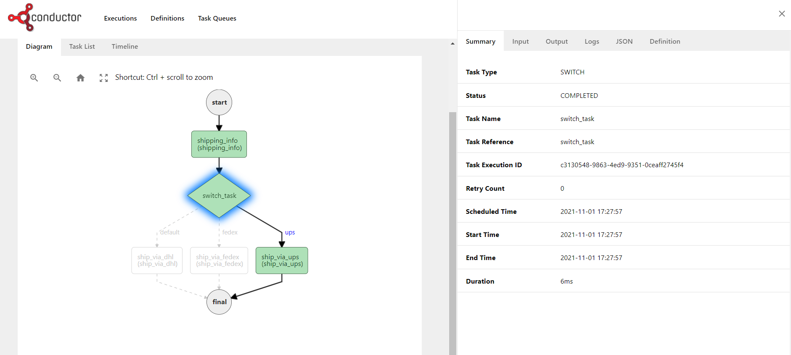

 ## マイクロサービス時代のワークフローシステム
  〜Netflix Conductorを例に〜

---
# 自己紹介
- 松下正嗣
	- Javaプログラマー/アーキテクト。クレディセゾン社で、ソフトウェア開発内製化に取り組んでいます。
 - 副業で会社もやってます。主に研修。
 - 最初の仕事は研修講師->SIの現場へ。SIでは主に現場用のフレームワークを設計/実装するアーキテクトの仕事。クレディセゾンではインフラ仕事が多くなっています。
- 大学/大学院と文系でした。
- 趣味は演劇(役者やる人)
---
# お話しする内容
- ちょっと国外で流行り出しているワークフローシステムとは何か
  - いわゆる申請承認を扱うシステムではない
  - いくつかの事例
- ワークフローシステムが求められている背景。
- OSSプロダクトのデモ


---
# ワークフローシステムとは？
"もともと1回限りのバッチパイプラインが継続的に結果を更新しなければならないというビジネス上の要求に対応しきれなくたってしまっている...
こうしたニーズに直面したに直面したGoogleは2003年にWorkflowというシステムを開発したました。これは継続的な処理を大規模に行えるようにしたものです。" 

『SRE サイトリラアビリティエンジニアリング』
25章 データ処理のパイプライン

---
# ワークフローシステムとは？
- タスクを実行するワーカーとそれを制御するコントローラ
- スケーラブル(worker/controllerともに)
- 冪等でシンプルなタスクをworkerが実行し、controllerが制御する
  - 人のタスクも組み込むことも可能。

<div style="text-align: center">

</div>

---
# 代替サービス?
- バッチ処理と呼ばれる長期/スケジュールタスク
  - ジョブスケジューラ(cron/商用スケジューラ/Apache Aireflow/その他)
  - スループットの大きい非同期処理には対応していない。
  - ジョブ実行サービスを立てることで準オンラインに対応している場合も多いが、ジョブネット/フローがスケジューラ管理。

--- 
# 代替サービス?
- 主にシステム間連携に利用されるメッセージキューシステム/オンライン非同期
  - メッセージングシステム/ストリーミングシステム(IBM MQ/Rabbit MQ/Kafka)
  - リトライや結果整合性は担保できるがフロー全体の管理とデータ整合性確保は課題。DBなどで頑張ることになる。
  - フロー制御が標準化されたものではなく、コードで頑張ることになる


---
# 海外でのプロダクトの誕生
- [Temporal](https://temporal.io/)
  - Uberで開発された[Cadence](https://github.com/uber/cadence)をforkしてビジネス化
  - TemporalのCTOはuberの前はAWSのStep Functionの全身AWS Flowのエンジニア
  - Thoutworks Tech Radarでも言及
  - TemporalのサービスはGoで書かれている。
    - workerはgoのほか、JavaやNode.jsやpythonで記述可能
--- 
- Temporalのアーキテクチャ
<div style="text-align: center">

</div>

--- 
### TemporalのWorkflow
- 様々な言語のSDKで記述。
- workflowとtask(Temporalの中ではActivity)を全てコードで記述
```java
// Workflow interface
@WorkflowInterface
public interface YourWorkflow {

    @WorkflowMethod
    String yourWFMethod(Arguments args);
}
```

---
- [Conductor](https://conductor-oss.org/)
  - Netflixで開発されたデータパイプラインOSS。独立して[orkes社](https://orkes.io/)がビジネス化。
  - Conductorをベースにしたデータ処理基盤maestroをNetflixが最近公開
  - Spring Bootベースで記述
    - workerはJavaだけではなく、GoやPhthon、Clojureなどでも実装可能
---

- Conductorのアーキテクチャ
<div style="text-align: center">

</div>

--- 
### ConductorのWorkflow
- Jsonで記述。GUI機能あり。フロー制御あり。
  - workflowから呼ぶタスクはコード  
<div style="text-align: center">

</div>

--- 

 <!-- _class: lead -->
### 実は結構いろんなコンポーネントやストレージサービスが必要なので、自前で運用するのは結構めんどいって特徴が。。。。商用サービスが成立する理由。。。

---
# 求められる背景
<style scoped>
section {
  font-size: 32px;
}
h1{
	
}
</style>
- ジョブスケジューラでは対応できない、長期/短期の継続的データ更新パイプラインの必要性
- 自動テストとCI/CDへの対応
- スケーラビリティ/低レイテンシー
- 分散システムの要求
  - 処理が分散されたフロー全体の整合性の確保とリトライや例外処理/サーガパターン
  - 一時停止/リトライ/人の作業との連携等の柔軟なビジネスフローの実現
  - ビジネスロジックの時間的疎結合化⭐️

---
# ビジネスロジックの疎結合化
- 紙での業務フローは本質的に疎結合。最終的に結果が整合すれば良い。
- ビジネスはコンピュータの中だけで完結しない。ユーザーとの連絡、物理的な流通、人手による入力などによる対応がある。それらをうまくマネージできることがデジタルサービスには必須。
- 従来運用や人手で統合できなかったビジネスフローを実現する意味で真のDX/新しいサービスには不可欠な基盤なのではないか。

---
# ビジネスロジックの疎結合化
- uber eatsのサービス
  - 注文-店舗-ドライバー-顧客を繋ぎ、イレギュラーな状態になると多様なアクターが回復行動を行い、それがサービス上で実現する。
   -  住所が登録されてない、不在。商品作成の遅れ。。。etc

--- 

 <!-- _class: lead -->
# 現実に使えるの？
## Conductor OSSを例に

--- 
# Conductorの基礎概念
### workflow
- タスクを実行するフロー。Jsonで記述する
- フロー制御やリトライを行う

### Task
- ワークフロー内で実行されるタスク
- ビルドインされたシステムタスクとworkerが実行するタスクがある

--- 
# 開発手順
### workflowとタスク
- APIで登録

### Task定義
- Simpleタスクはworkerを開発して実行。タスク名を持つタスクが実行される。

---
# Java Worker
- Workerインタフェースを実装する。

```java
public class SampleJavaWorker implements Worker {
    private final String taskDefName;
    public SampleJavaWorker(String taskDefName) {
        this.taskDefName = taskDefName;
    }
    @Override
    public String getTaskDefName() {
        return taskDefName;
    }

}
```

---
# Java Worker
- Workerインタフェースを実装する。

```java
//続き
    @Override
    public TaskResult execute(Task task) {
        System.out.println(task.getInputData());
        TaskResult result = new TaskResult(task);
        result.setStatus(TaskResult.Status.COMPLETED);
        return result;
    }
}
```
---
# pollingの設定と開始
- mainメソッドなどに記述する

```java
        TaskClient taskClient = new TaskClient();
        taskClient.setRootURI("http://localhost:8080/api/");


        Worker worker1 = new SampleJavaWorker("task_1");
        Worker worker2 = new SampleJavaWorker("task_2");
        Worker worker3 = new SampleJavaWorker("sample.task1");

        // Create TaskRunnerConfigurer
        TaskRunnerConfigurer configurer = new TaskRunnerConfigurer.Builder  (taskClient,
                List.of(worker1, worker2,worker3))
                .withThreadCount(3)
                .build();

        configurer.init();
```

--- 
# 実際の実行
- API/UI経由でworkflowを開始。
- 開始中のワークフローは実行ID単位で一時停止/再実行など自由にできる

--- 
# その他考慮点
<style scoped>
section {
  font-size: 28px;
}
</style>

### バージョニング
 - ワークフローにバージョンを指定することが可能
 - 同じ名前でバージョン指定でworkflowを実行した場合、最新が実行される。
 
### タスク設計の考慮事項
 - リトライが発生するため冪等性を担保すること

### 冗長性
 - serverの冗長化をする場合はEurekaでマスターを決める
 - workerも冗長化可能


--- 
# まとめ
- conductorについて
  - 手軽に小規模スループットなら十分実験的には利用可能
  - スケジュール機能など一部機能がOSSでは制限されており、本格的に利用するには商用版を使うことになる気はする。もしくは商用機能を自前で開発するか。
  - temporalの方がOSSとしての機能は充実している。
--- 
# まとめ
- 各種のサービスや業務フローを統合するワークフローシステムは魅力的なデジタルサービスを開発するには不可欠であるという気がしている。
- OSSをベースにするか、商用製品を作るか、はたまた自分たちでユースケースにあった同等もしくはより狭いユースケースに特化したものを開発するのか。


--- 
# 参考記事
[Temporalというマイクロサービスオーケストレーションについて](https://cloudandbuild.jp/blog/article-20220508)
[SRE サイトリライアビリティエンジニアリング](https://amzn.asia/d/8LPfFDk)
[サーガパターン](https://learn.microsoft.com/ja-jp/azure/architecture/reference-architectures/saga/saga)


