 ## Springを武器に闘うレガシーアーキテクチャ 
  〜オンプレ/EJB2からのEKS/Spring Bootへの移行奮闘記〜

---
# 自己紹介
- 松下正嗣
	- Javaプログラマー。クレディセゾン社で、ソフトウェア開発内製化に取り組んでいます。
	- 最初の仕事は研修講師->現場へ。大学/大学院と文系でした。
---

# チームの紹介
- テクノロジーセンター
  - CTO直轄の新組織。外部からの転職組のみで当初スタート。出身もSIやスタートアップなど様々。
  - 社内業務システム改善のため、エンジニアと他部門からの移動組で内製化チームが発足 

---
 <!-- _class: lead -->
# 移行プロジェクトの概要
---
# オープンGW
- カード会員向けサイト（Netアンサー）/ポータルアプリなどのオープン系システムとホストを中継するAPI基盤
- アーキテクチャ
	- EJB2/Oracle RAC/ホスト接続は独自プロトコル
<div style="text-align: center">

</div>

---

# 移行プロジェクトの経緯
- ハードウェア更改に合わせて、メインフレーム上のOpenshiftに基盤を変更する再構築プロジェクト。内製化チームで更改を実施することに。
- リリースの９ヶ月前（システム間結合テスト３ヶ月前）に基盤をAWS/EKS/Aurora Postgresに変更。AWS基盤は内製化チームで構築。リリース計画変更はなし。
- 無事計画通りリリース。従来ディスク不足や性能問題に悩まされていたが安定稼働。

--- 

# 今日話すこと
- アプリケーションアーキテクチャの移行
- システムアーキテクチャ(AWS/ESKへの移行)
- 文化とプロセスの移行

# あまり話さないこと
- DB移行

---


 <!-- _class: lead -->
# アプリケーションアーキテクチャ移行

---
<style scoped>
section {
  font-size: 32px;
}
h1{
	
}
</style>

# The レガシーコード!!!
- ビルドツールなし/バージョン管理なし/テストなし
- Web APIなのに固定長
- 数千行のメソッド/コピペで作られた重複コード
- 至る所にあるSQLの断片
- 至る所にあるtyr-catch。ログにも出さずに握りつぶされる例外
- 大量のMap。ジェネリクス宣言なし
- ホストと接続するのは、socketプログラミングで作られた独自プロトコル
### -> それでも。。。動いて価値を産み出している

---
 <!-- _class: lead -->
# "ほとんどをそのままにしておく"
G.M.ワインバーグの変革の原則
<div style="text-align: right">

</div>

---
 <!-- _class: lead -->
 ### 移行基本戦略とビジョン
- ビジネスのコアとなる業務ロジックには変更しない
	- ドメインや周辺システムの事情は当時はわからなかった
- 一旦手の内化してから改善を進める
	- 技術領域/処理方式は"分かる"。改善策もある
	-  ease of development
	- 機能豊富なFW/基盤の採用
	

---
# フレームワーク移行
- Webアクセス/コントローラ部分
	- 生Servlet+EJB2によるビジネスコンポーネント呼び出しをSpring Bootへ書き直し。
- 共通処理/Util系/DBアクセス
	- 内部でSpringのBeanを呼び出すことでSpringの多様な機能を利用できるように
	- DBコネクションはDataSourceUtilsから取得し、トランザクションをSpringの管理下に。
---
# 処理構造

<div style="text-align: center">

</div>

---
## ビジネスコンポーネント呼び出し
SpringのBeanとして登録したビジネスコンポーネントのメソッドを関数型インタフェースとして取得し、実行。AOP/Filter/宣言的トランザクションなどのSpringの共通処理機構が利用できるようになる。
```java
//Adapterのコードイメージ
BizFunction bizFunction = resolver.resolveBizFunction(request);
Response response = bizFunction.doService(request);

```
---
## インフラアクセスはSpringの機能に差し替え 
既存Utilメソッドを無理やりSpringを利用したコードに。。。
```java
@Bean
public class XXXUtil {
　private static SpringService springService;
  @Autowired
  public void setSpringService(SpringService springService){
	XXXUtil.springService = springService;
  }
  //staticメソッド
  public static Map select(){
	springService.doService()
  }
}

```
---
SqlConnectionを使ったインタフェースに対しては共通親クラスがコネクションを提供。親クラスではDataSourceUtilを利用してトランザクションをSpringに管理させる。
```java
//ビジネスロジック
SqlConnection con = getConnection(); //親クラスの実装でDataSourceUtilを利用。
String sql = "select XXX from YYYY where id = ?";
Map result = DaoUtil.select(con,sql);

```
---
# ホスト接続の独自プロトコル
- ホストアクセス部分はsocketAPIをガリガリ使った<strong>常時接続</strong>の独自実装。切断する場合などは接続先との調整も必要。リリース後の足枷になるリスクがあると判断。
- ビジネスロジックからのインタフェースは変更せず、Spring Bootの別アプリにコードを移植し、WebAPIとして切り出した。
<div style="text-align: center">

</div>


---

 <!-- _class: lead -->
# テスト戦略 
---
<!-- _class: lead -->
## テストの目的
### "バグを検出すること"

---
# どこでバグが出るかを検討
- 変更は主にFW部分/ビジネスロジック呼び出し部分、FWと結合しての挙動確認が必須。
- DBMSの変更も入ったため、SQLはテストしたかったが、SQLが至る所に散らばっており、単体テスト不可。
### -> 単体テストを頑張ってもバグは出ない
---
# テスト方針
- E2Eテストによる外部仕様の原新比較を中心にする
	- テスト仕様の可読性を考慮してKarate を採用。既存システムから通信ログを取得しテストを記述
	- 共通部品は一部単体テストを記述
	- CIで回帰テストを繰り返す
- システム間結合テスト
	- 基本シナリオを手動で実施。
		- バグが出たら、再現するテストを記述して修正

--- 
# テストに関してその他
## CIの改善
- E2Eテスト中心だとSpringBootTestになり、どうしてもテストが遅くなるが、ある程度は許容。サーバの立ち上げ直しなくケース消化できるようにHackした。現在では大体10分程度で全テストが終わる。

---
# リリース時に入れた改善
### とにかく保守/運用が楽になるように。。。
- 観測性:メトリクス/ログ/トレース
	- stackトレースをちゃんと出力するように
- サーキットブレーカー/流量制限	
- 例外処理とログ出力の改善
	- 無駄なtry-catchを避けるため、共通部品で実行時例外をスロー。業務例外はチェック例外とし、infoログを出力して発生行数/理由などを解析できるように修正。
	- 性能情報/SQLも実際に遅くなったタイミングでログ出力

---
# 実際どうだった？ 
- プロジェクト開始前の予備調査の段階で、Spring Bootへの移行/既存通信ログを利用した現新比較を行うE2Eテストは実際に動いていた。なので、自信を持ってプロジェクトに参画/遂行できた。
- システム間結合テスト３ヶ月前にはアプリの移行は完了していた。３ヶ月ほど開発メンバーには研修/勉強時間にあてる余裕があった
	- 後述のシステム基盤のAWS移行というチャレンジができたのはすでにアプリの移行が終わっていたから。

---
# 実際どうだった？ 品質
- FW側修正のバグは出たが、ビジネスロジック部分のバグはなし。リリース後も同様
---
# 実際どうだった？ リリース後
- 周辺システムで性能劣化が発生した場合などインフラ部分をSpringにしたお陰ですぐに非同期処理化ができた。良かったことは数え切れない。

---
 <!-- _class: lead -->
# システムアーキテクチャ移行

---
# 経緯
- プロジェクト発足当初はメインフレーム上のOpenshiftに移行する計画。
- システム基盤はベンダーが提供し、アプリをその上に載せる、という体制だったが、基盤含めてコントロール/今後の発展性という観点からAWS移行へ。
	- コストや実現可能性のほか、信頼性や周辺システムとの接続性などを検討の上判断
	- AWSの支援やエンタープライズサポートもありGO。システム結合テストの３ヶ月前。。。

---
# 技術選定:Why EKS?　
- その他の選択肢
	-  EKS or ECS or EC2　その他 。
- こんなこと考えた
	- そもそもk8sで設計してた。特にバッチ。
	- ホスト接続など特殊要件もあり、思わぬところで詰むのが怖かった。EKSの方が自由度の高い選択肢と考えた。
	- Spring Bootはk8s前提の機能が豊富
### ->　決め手はないし、今も悩んでる。。。

---
# EKS選定にあたっての考慮事項
- オープンGWをプラットフォームとして育てていく
	- 単一のアプリを載せるにはtoo match
- k8sの設計はシンプルに保つ。コンテナオーケストレーション機能に留める
	- Istioなど複雑性を増すものはできるだけ避け、k8sのサービスで不足する場合はSpringの機能を活用する
	- k8s上にミドルウェア的機能は持たせず、できるだけAWSのサービスを活用する
	- デプロイの容易性を重視。日中サービス無停止でリリース可能にする。
	- IaCの徹底。AWSインフラはCDK。EKSはeksctl + configファイルでgit管理
---
# EKS選定にあたっての考慮事項
- IaCの徹底
	- AWSインフラはCDK。Java屋が多いのでJavaで。。。
	- EKSはeksctl + configファイルでgit管理
- システム間結合テスト後、システムテスト前に実はEKSクラスターは何度か構築し直していた。変更が必要になったというより、構築手順検証やクラスターアップデート(blue/green)を見据えて。

---
# CDK使う時の工夫
- レイヤ1,2であるもの、ないものあったり、バージョンアップへの差分...
- コードをきちんと設計しないとカオスに。。。
### ->環境ごとの設計内容を外部yamlファイルに定義し、それをJavaで読み込んでCDKで構築
- CDKのコードは単純な手続き/関数で誰でも読める
- 設計内容はyamlでシンプルに。変更はyamlファイルを変更してdeploy

---
# AWSとの連携
- テストがしにくくなるので、アプリにはAWSへの依存は入れず、k8sの各種機能を介してAWSサービスを利用
	- secret Manager -> Secrets Store CSI Driver
	- cloudwatch metrics-> cloudwatch agent for prometheus
	- S3連携などは専用のAWS連携アプリを作成

※　そこまでこだわっているわけではないので、今後かわるかも

---
# 流量制限
- 従来Apacheのコネクション数制限だけにしていたものをSpring/resilience4jで制限。負荷が上がってもシステムの全体的な停止を防ぐ
- ingressなどで制限もかけられたが、オープンGWの入り口とホストアクセスアプリ両方で制限するため、統一してアプリで制限をかけた
<div style="text-align: center">

</div>

--- 
# クライアントサイドロードバランシング
- ホスト接続アプリの無停止メンテナンスのため、k8sのサービスだけでは対応不可。
クライアントサイドロードバランシングをSpring/Ribbonで実現
	- サイドカーやnginxなどを検討したが、プロセスを増やすよりも単純と判断。
--- 
# クライアントサイドロードバランシング
<div style="text-align: center">

</div>

---
# オブザーバビリティ
- 一般的にはログ/トレース/メトリクス
- ログは、eksのデザインパターンに従い、fluent-bitでログ集約を実施。大量に出るアプリログはfirehose経由でS3に連携。warn/errorのみcloudwatchに連携し通知。s3内ログはAthenaで検索
- トレースはx-rayなどは使わず、ログにトレース情報を出力するのみ。
	- X-RAYなどのメリットがまだ見えなかったため。対応するか検討中
- メトリクスはSpring Bootアプリでprometheus メトリクスを出力し、cloudwatch agentで収集し、cloudwatchに連携

---
##  無停止ローリングアップデートに向けて
- Spring Boot Actuatorでk8sのLiveness Probe/Readinesss Probeに利用
- SpringのCommandLineRunnerにてウォームアップを実施。ピーク時にロールアウトリスタートしても問題ないようにする
	- ロードされてないクラスをロードする。(Servletを一回動かすなど)
	- 初期実行時にキャッシュを大量に取得するコードが存在していたため、それも実行
	- JITウォームアップの効果はあまりなかった。。。
---
#  サービス間バージョン管理
- ホスト接続アプリなどの内部サービスには、gitのハッシュ値を利用したイメージタグを名前に付与。接続元もそのハッシュ値を意識して接続する。

- 外部システムに公開しているAPIはバージョンを公開せず、blue/greenデプロイメントができるように作り込み。

---

# EKSで苦労した点
- IPアドレスが大量に必要
	- ISP用のshared アドレス帯をセカンダリーCIDRとして利用。外部システムと接続する際にはNLBを利用。。。
- ホスト接続は常時接続。NLBを利用した場合、350秒で切れるので、EC2インスタンスのシステムパラメータを変更

---

# 実際どうだった？
- 無停止でサクサクリリースが可能。1日複数回リリースもストレスなくできる
- システムの異常な状態や性能状態がリアルタイムでメトリクスで把握できる。 
- 利用状態の報告なども簡単に収集、分析可能
- クラスターアップデートはそれなりに大変。。。もっと楽したい。。。

---

# 今後やりたいこと
- OpenTelemetory/Aws Distro OpenTelemetory対応
- 行けるものはFargateへ
- Flux CDの導入によるクラスター構築自動化/インフラgitOps
- 標準的ツールによるblue/greenデプロイメントやカナリアデプロイ
	- 今は手作りしてる。。。
- 周辺システムもAWSに移行してきているので、Amazon VPC Latticeの導入

--- 
 <!-- _class: lead -->
# 文化とプロセスの移行

--- 
# ドキュメントと社内プロセス
- 社内プロセスで必要だったドキュメントや成果物は精査しなおして大幅に削減
- ソースそのままみたいな詳細設計書は保守担当と相談の上、全部削除。基本設計書/IF仕様書とソース/アーキテクチャ設計/開発ガイド等で保守を行う。
- インフラのドキュメントも保守・運用で利用していない資料は全部削除

--- 
# リポジトリとブランチ戦略
- karateのGitHubリポジトリを参考に、1リポジトリにドキュメントやk8sマニフェストを含むほとんど全てのリソースを集約。
- ブランチ戦略はgit自体の開発に使われている"gitworkflow"をベースに改造。
	- topicブランチで案件毎の差分を管理
	- システム間結合テスト用の環境へはPUと呼ばれる捨てブランチを適宜作成し、テスト実施
	- テスト後topicブランチをmasterにマージ。リリース時はreleaseブランチにマージするとCDが動く
--- 
 <!-- _class: lead -->
 # 継続的改善
---
# 諸々改善進めてます
- 処理共通化
	- 一部の要求イベントごとに実装していたチェックロジックを共通化。宣言的なパラメータの記述で要求変更に対応できるようになった
- DBアクセスはMyBatisに
	- 新しい機能のDBアクセスはMyBatisでSQLを一元管理
- 新しいWebAPIを新規作成
	- 業務要件の見極めの付いた変更の多い機能について新しいエンドポイントを開発。単体テストを増やし、E2Eテストの比率を減らす
---

# その他
- 通常はクラウドに移行したからといって、大きなコスト削減が見込めるわけではない。当プロジェクトはかなりのコスト削減が実現でき、これが色々進めるのを楽に。。。	
- 今回のような一気にFW入れ替えはシンプルなAPI基盤だったという事情も大きい。今関わっている画面付きのシステムの移行は機能を切り出してリライトする方式で行っている。「ほとんどをそのままにしていく」にしてもどこをどのように保持し、変更するかはケースバイケース。
	- チームとして初の大きな仕事だったので多少無理したというのはある
--- 	
# 最後に	
- 実は一番大変だったのはOracle RAC->Aurora PostgreSQLへのDB移行とそれに伴う性能問題でした。。。チャレンジする方はお気をつけて。。。
	- Auroraが苦手なwriteヘビーな特性とPostgreSQLのパーティションに対する我々の理解不足 + 性能テストのデータ作成の問題で性能問題がなかなか解消せず。リリース後は余裕。。。
